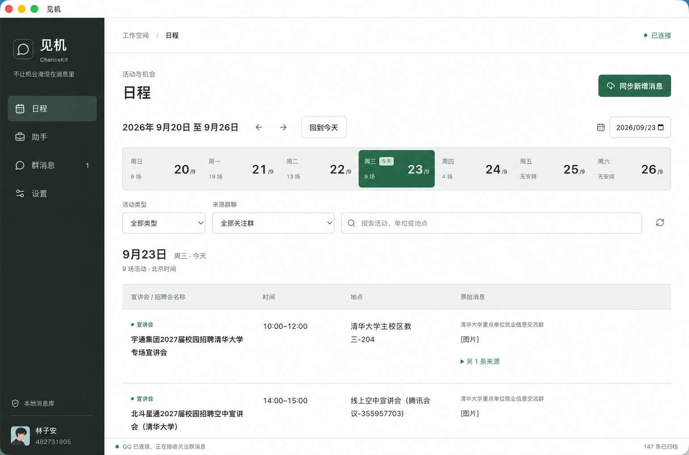
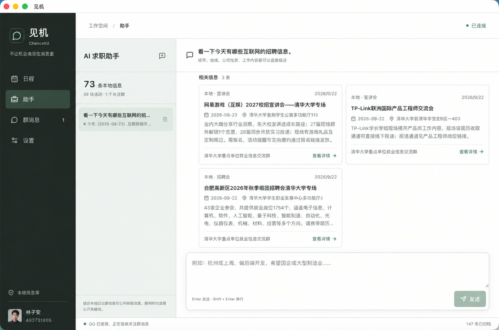

  

<h1 align="center">见机 ChanceKit</h1>

<strong>群里刷过的招聘通知，变成查得到的资讯、排得清的日程。</strong>

关注 QQ 群，归档消息，用 AI 整理招聘信息，再带着来源查找适合自己的机会。

⭐ 如果见机对你有帮助，欢迎给项目点个 <a href="https://github.com/x-tok/ChanceKit"><strong>Star</strong></a>，支持我们继续完善它。

  <a href="#免责声明与隐私提醒">免责声明</a> ·
  <a href="#下载">下载安装</a> ·
  <a href="#功能预览">功能预览</a>
   
  <a href="#使用指南">使用指南</a> ·
  <a href="docs/README.md">文档</a> ·
  <a href="https://github.com/x-tok/ChanceKit/releases">版本记录</a>

## 免责声明与隐私提醒

> [!WARNING]
> **使用前请务必阅读：启用 AI 功能后，相关信息会发送给你配置的模型提供商，对方会收到并处理这些内容。消息保存在本机，并不代表 AI 处理也只在本机完成。**
>
> - **消息整理会发送群聊内容。** 首次设置中确认同步与模型处理，或之后开启自动处理时，关注群的消息、提取所需的同群上下文，以及相关网页、图片和支持的附件内容会发送给模型提供商，其中可能包含他人的个人信息。
> - **使用助手也会发送信息。** 发送提问时，模型提供商会收到你的提问、最近的对话上下文、本地数据范围与群名，以及助手为回答检索到的本地消息或网页内容。**关闭自动处理不会阻止助手发送这些信息；“只查本地”仅限制检索来源，回答仍需调用已配置的模型服务。**
> - **请先确认你有权发送这些数据。** 不要提交未经授权的群聊内容、个人隐私或机密材料。第三方的数据记录、使用、保留、训练及传输规则以其条款和隐私政策为准，项目维护者无法控制。调用模型可能产生费用，暂停处理不保证撤销已发送或已计费的请求。
> - **AI 结果需要人工核实。** 招聘信息、活动时间、报名截止日期和助手回答可能有误或不完整，请以原始通知和官方渠道为准。软件按现状提供，不保证结果准确、历史消息完整或服务持续可用。
> - **QQ 接入存在兼容性与账号风险。** 见机通过 NapCatQQ 接入 QQ，并非腾讯或 QQ 官方产品，不保证所有 QQ 版本可用，也不保证账号不受风控影响。请自行评估使用风险，并妥善保护账号、密钥和本地数据。
>
> 项目维护者不运营接收用户数据的应用后端，也不会因你安装或运行见机而自动收到上述信息。本地消息数据库目前没有整库加密，请勿公开或分享完整数据目录。
>
> 使用前请阅读完整的[免责声明](DISCLAIMER.md)与[隐私及数据处理说明](PRIVACY.md)。

## 下载

  
  
  

下载入口对应 **v0.1.2**：Apple 芯片的 Mac 选择 Apple Silicon，Intel 芯片的 Mac 选择 Intel，Windows 支持 10 / 11 x64。其他版本及 ZIP 包见 [Releases](https://github.com/x-tok/ChanceKit/releases)。

> 当前为开发版，安装包可用性以 Releases 为准。内置 NapCatQQ 适用其受限非商业再分发许可证，并随包提供完整许可证、来源和版权信息。详见[第三方许可说明](THIRD_PARTY_NOTICES.md)。

请先安装[官方 QQ](https://im.qq.com/)。安装包暂未正式签名，macOS 首次打开可能被系统阻止，处理方式及各平台验证状态见[安装说明](docs/releases.md)。

## 功能预览

**从群消息到日程，再到你的下一步。** 关注的群消息归档在本机，招聘通知保留原文与来源，安排明确的活动进入日程，也可以直接向助手提问。

下方两张图片为界面示意图，展示日程与助手的使用场景；界面细节以实际版本为准，图中日期、账号、群聊、招聘内容与回答仅用于演示，不作为真实招聘通知或投递依据。点击图片可查看大图。

### 01 · 日程日历，先看今天有哪些机会

宣讲会、双选会、面试、笔试按日期集中展示。按类型或来源群筛选，查看时间、地点，再回到原始消息确认细节。

  

日程日历 · 类型与群聊筛选 · 原始消息溯源

### 02 · 求职助手，把想找的机会说出来

描述城市、公司或岗位，结合本地消息与公开招聘网站查找机会。除了查询招聘信息，也能讨论简历和面试准备。

  

自然语言提问 · 本地与网络检索 · 来源详情

### 消息和材料，也有地方可查

| 功能 | 如何使用 |
| --- | --- |
| **群消息归档** | 选择关注的 QQ 群，同步后在本机搜索、离线阅读或导出 |
| **招聘资讯整理** | 从文字、链接、海报和支持的附件中提取信息，保留来源以便核对 |
| **待补全材料** | 没读全的海报、链接与附件保留入口，方便查看原因或重新读取 |

## 使用指南

### 三步开始

1. **准备 QQ**：安装官方 QQ，登录一次并等待最近消息同步完成。macOS 用户随后正常退出 QQ，按提示准备独立运行副本，需额外约 1 GB 空间。
2. **配置模型**：按首次设置页面填写 DeepSeek API Key，确认账户有可用额度并通过连接测试。
3. **扫码选群**：用手机 QQ 扫码，选择要关注的群聊，确认同步与模型处理。首次设置同步最近三天的消息，完成后断开 QQ。

### 日常使用

- 在“群消息”中搜索、离线阅读或导出已归档的消息；连接 QQ 后可手动获取更早记录。
- 在“日程”中按日期查看活动，按类型或来源群筛选；“招聘资讯”保留招聘公告和待补全的材料。需要继续整理消息时，开启“自动处理”。
- 在“助手”中描述想找的城市、公司或岗位，结合本地信息与公开招聘网站查询，也可直接咨询简历和面试问题。只想查询群消息时，可以明确要求“只查本地”。
- 首次同步后需要继续采集消息，可在“设置”中重新连接 QQ。断开连接后，已归档的消息仍保留在本机。

### 模型配置

首次设置使用 DeepSeek。后续可在“设置”中切换模型服务商、模型或自定义 API 地址，测试连接后保存。更换服务商、协议或 API 地址时，需要重新填写 API Key；密钥加密保存在本机。连接测试只发送固定测试消息，不读取 QQ 消息，也可能产生少量费用。

消息归档保存在本机；启用模型整理后，相关消息与材料会发送给你配置的模型服务商，可能产生费用。模型结果请核对原文，数据处理方式见[隐私说明](PRIVACY.md)。

### 已有 NapCat

在连接设置中选择“已有 NapCat”，填写 OneBot WebSocket 地址和访问令牌。需要在见机中扫码登录时，再启用登录管理，填写 WebUI 地址和对应令牌。

本机连接可使用 `ws://127.0.0.1:<端口>`；远程消息连接使用 WSS，远程登录管理使用 HTTPS。不要把令牌放进 URL，也不要公开管理端口。

### 常见问题

- **没有找到 QQ**：安装官方 QQ 后重新检测，或手动选择官方 QQ 的安装位置。
- **macOS 提示 QQ 正在运行**：正常退出官方 QQ 后再连接。
- **没有出现二维码**：先查看连接状态，已有登录资料有效时可能直接恢复登录；外接 NapCat 还需检查 WebUI 配置及登录管理开关。
- **连接成功但没有消息**：先关注群聊，再同步消息。可获取的历史范围取决于 QQ 实际返回的记录。

更多设置细节与问题说明见[使用详解](docs/user-guide.md)。

## 文档

| 想了解什么 | 阅读 |
| --- | --- |
| 安装、系统提示与平台支持 | [安装与发布](docs/releases.md) |
| 更多模型选项、助手能力与使用限制 | [使用详解](docs/user-guide.md) |
| 日历、资讯与材料处理规则 | [日程与活动处理](docs/activity-processing.md) |
| 数据存放位置、QQ 关系与更新保留规则 | [数据与隐私](docs/data-and-privacy.md) |
| 从源码运行、构建与项目结构 | [开发与构建](docs/development.md) |

接入实现、设计约定及更多资料见[完整文档目录](docs/README.md)。

## 贡献与许可

欢迎通过 Issue 或 Pull Request 反馈问题、补充兼容性结果。反馈请使用脱敏数据，贡献前阅读[贡献指南](CONTRIBUTING.md)。

ChanceKit 自有代码采用 [PolyForm Noncommercial 1.0.0](LICENSE)，仅允许许可证规定的非商业用途。第三方组件保留各自许可，见[第三方许可说明](THIRD_PARTY_NOTICES.md)。见机不是腾讯官方产品，使用前请阅读[免责声明](DISCLAIMER.md)。

## 致谢

本项目使用 [NapCatQQ](https://github.com/NapNeko/NapCatQQ) 提供 QQ 连接、登录与消息接入能力，感谢 NapCatQQ 开发者的工作。安装包使用未经修改的固定版本官方组件，并附带完整许可证、来源和版权信息；不得将其用于商业用途。再分发条件见[第三方许可说明](THIRD_PARTY_NOTICES.md)。
